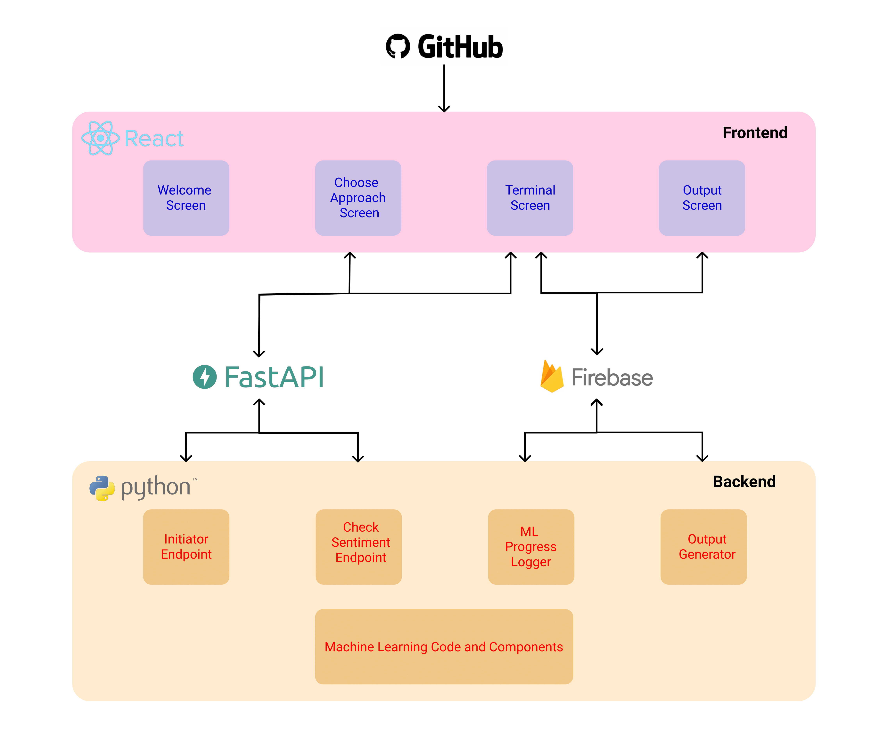

# ReviewZon

ReviewZon is a ML based tool that helps users make smart decisions by analyzing amazon reviews of a product.

## Objective

Our project’s aim is to classify reviews of a product into positive and negative sentiment groups. When using ReviewZon, the user can choose their test and train sets. For both, the test set and the train set, the user can decide if they want to use a local (pre downloaded) dataset, or a set of amazon product links from which a dataset of reviews can be built. Using the chosen datasets, a model is trained, validated, and tested. Both the flows are described below in detail.

## Flow

There is 3 key aspects to our project:

- Training the model
- Visualization of the data
- Experiments on the model

### Training the model

After preprocessing the data, ...

### Visualization

Visual representation of data is a major part of data science and data mining.
By visualizing data, one can easily determine the trends and patterns in the data.
A lot of visualizations can be done with the data we obtained and processed in the previous steps.
We have used the following in our project:

- Sentiment vs Helpfulness Graph
- Year vs number of reviews (Grouped by sentiment)
- Day vs Review Count Graph
- Rating Distribution
- Sentiment Polarity Distribution
- Review Length Distribution
- Review word count distribution
- Frequency of words (Grouped by sentiment)
- Word Clouds

### Experimentation

We are using cross validation to choose the best model and hyper parameters.
We will validate each classifier and it's hyper parameters using Recall, Precision, Specificity, Accuracy, and most importantly AUC-ROC curves.

### Architecture of the project



## Backend

This repository contains the code for the backend of the project, that runs on a server that can communicate with the frontend.

To run the backend, clone the repository by running the following command:

```bash
git clone https://github.com/z404/reviewzon-backend.git
```

Create a virtual environment and install all the required packages:

```bash
virtualenv venv
source venv/bin/activate
pip install -r requirements.txt
```

This code requires a file `config.json` to be present in the root directory of the repository. This file contains the credentials for the API keys of ScraperAPI and Firebase.

Sample config.json file:

```json
{
  "ScraperAPI": 
    ["<API_KEY_1>",
     "<API_KEY_2>",
     "<API_KEY_3>"],

  "firebaseConfig": {
    "apiKey": "<API_KEY>",
    "authDomain": "<Auth_Domain_URL>",
    "databaseURL": "<Database_URL>",
    "projectId": "<Project_ID>",
    "storageBucket": "<Storage_Bucket_URL>",
    "messagingSenderId": "<Sender_ID>",
    "appId": "<App_ID>",
    "measurementId": "<Measurement_ID>"
  }
}
```

The backend also requires `\images` and `\models` directories to be present in the root directory of the repository.

```bash
mkdir images
mkdir models
```

To run the backend, run the following command:

```
python app.py
```

The ML model runs on a thread, so pressing ctrl+c will not stop the model. To stop the model, run the following command:

```
kill -9 <PID>
```
